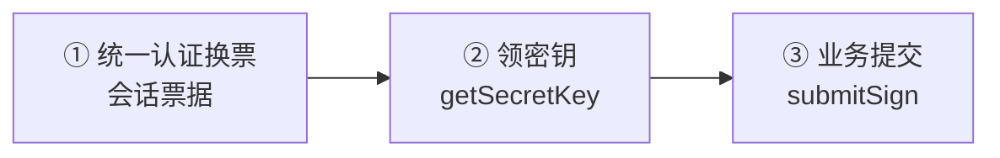

# 今日校园签到协议分析

**CampusNext iOS 客户端签到链路的一次协议分析记录**

把「登录怎么换票、密钥怎么下发、请求体怎么加密、签名怎么拼」逐层看清楚，
而不是做一份能替你完成签到的操作手册。

---

> [!WARNING]
> **这份记录不是工具，也不打算成为工具。**
> 签到关乎出勤与安全责任：程序能模拟的只是一个 HTTP 请求，模拟不了一个人的到场。
> 请勿将本文内容用于任何违反校规或法律法规的用途。

> [!CAUTION]
> **签到会触发设备验证风险。** 服务端会校验账号与设备的绑定关系，异常提交会被判定为
> 「更换手机频繁 / 设备未授权」，需管理端人工授权才能解除。这是有意设计的一道防线，
> 本记录不提供绕过它的任何方法。

> [!NOTE]
> 仓库中的样本、密钥、设备标识与账号信息均已脱敏为占位值；
> `config.yml` 里的学校与校区坐标为占位值。

---

## 摘要

| 项目 | 内容 |
| :--- | :--- |
| **分析对象** | 今日校园 CampusNext · iOS 9.9.22（对照 9.9.7 样本） |
| **分析范围** | 统一认证换票 · 动态密钥下发 · 业务请求提交 |
| **方法** | 静态分析与行为对照，结论以服务端实际响应为准 |
| **主要结论** | 加密链路已完整复现；**设备授权风控无法绕过** |
| **项目定位** | 协议分析记录 —— 非面向使用者的软件 |

---

## 目录

- [一、这份记录的定位](#一这份记录的定位)
- [二、声明与边界](#二声明与边界)
- [三、分析对象](#三分析对象)
- [四、链路概览](#四链路概览)
- [五、关键结论](#五关键结论)
- [六、风险与边界](#六风险与边界)
- [七、仓库内容说明](#七仓库内容说明)
- [八、未决问题](#八未决问题)
- [九、来源与演化史](#九来源与演化史)
- [十、许可证](#十许可证)

---

## 一、这份记录的定位

**技术只是一时，不能代表一切。**

这里的每条结论都绑定在具体版本上（iOS 客户端 9.9.22，并对照 9.9.7 的样本）。接口路径、
密钥、字符串混淆方式都会随版本变化，今天成立的结论明天可能就失效。请把它当成某个时刻的
快照，而不是一份长期有效的能力。

写这份记录也不意味着技术能替代什么。签到这件事本身关乎出勤与安全责任：程序能模拟的只是
一个 HTTP 请求，模拟不了一个人的到场。

---

## 二、声明与边界

| 边界 | 说明 |
| :--- | :--- |
| **无法替代真实签到** | 不鼓励、也不支持用任何自动化方式代替本人在场。任何「自动完成」都只发生在服务器能看到的报文层面，不代表人到了。 |
| **会触发设备验证** | 服务端校验账号与设备绑定，异常提交判为「更换手机频繁 / 设备未授权」，需管理端人工授权解除。不提供绕过方法。 |
| **不含可用凭据** | 样本、密钥、设备标识、账号信息全部脱敏为占位值；`config.yml` 的学校与校区坐标为占位值。 |
| **仅供学习交流** | 仅用于协议学习与安全研究。请勿用于违反校规或法律法规的用途。 |
| **时效性免责** | 不保证结论的准确性、完整性与持续可用性，也不对其被用于何种目的负责。 |

---

## 三、分析对象

| 项目 | 说明 |
| :--- | :--- |
| 客户端 | CampusNext iOS 9.9.22（对照 9.9.7 的样本） |
| 观察面 | 登录换票、密钥下发、业务提交三段链路 |

> 具体的逆向工具链、样本与提取过程不在本仓库内，本文只记录结论。

---

## 四、链路概览

整条链路可分成三段，彼此相对独立：

三段里最容易被误判为「简单」的是第二段：密钥并非写死在客户端里的常量，而是服务端按租户
下发、再与客户端本地常量做一次交错运算后才得到最终 key。这解释了为什么把样本里的密文与
密钥直接抄下来很快会失效。

---

## 五、关键结论

### 1. 请求体加密链路

- 算法为 **AES-128-CBC + PKCS7**，输出 base64。
- 密钥不是单一常量，而是「客户端本地常量 + 服务端下发租户密钥」按奇偶位交错重组的结果。
- IV 为静态字节序列，不随机。
- 加密前的明文是一段 JSON，字段覆盖定位、设备标识、账号标识、系统与版本信息。

> **结论：密钥材料一半来自客户端、一半来自服务端** —— 只补一端无法复原完整 key。

### 2. 密钥下发接口

- 接口采用版本化路径，算法版本字段取值必须与当前客户端一致，否则返回「请升级最新版本」。
- 响应体不是明文，而是 RSA-1024 / PKCS1v15 密文。
- 解密后是管道符分隔的三段：随机串、`cpdailySecret`、`catSecret`。

### 3. 登录与换票

- 客户端已从 App 老流程切换到**网页版登录流程**：老流程（query 参数 + AES(salt) 密码）会被直接拒绝。
- 网页版流程中密码用 RSA-1024 / PKCS1v15 加密，并带固定前缀标识；图形验证码按服务端要求出现。
- 换票依次得到三类票据：会话票据、统一认证票据、业务域票据。业务域票据有效期短且易被风控作废，必须登录后即时使用。
- 会话可以落盘复用（本地按 7 天计），但复用能否成功取决于服务端是否已将其作废。

### 4. 请求签名

- 签名由「排序后的表单值 + 加密后的请求体 + 密钥」拼接后取摘要生成。
- 协议中同时存在业务版本字段与遗留的算法版本字段，两者取值不同，不能合并理解。
- 拼接格式未完全确定，但服务端并未严格校验 —— 这本身就是一条信息。

> **风控的重点不在签名，而在设备与会话。**

### 5. 旧协议的对照

早期版本走 ECB 模式 + 固定密钥的方案，密钥随版本更换过。这条线目前已不可用，保留在记录里
作为「协议会变化」的实证。

---

## 六、风险与边界

| 风险 | 说明 |
| :--- | :--- |
| **设备绑定（主要矛盾）** | 提交进入业务层后返回的往往是「更换手机频繁 / 设备未授权」，而不是加密错误。即使把加密链路完全复现，仍然过不了设备授权这一关。 |
| **版本时效性强** | 密钥、混淆方式、接口版本化都随客户端更新变化，任何实现都需要持续跟进，而跟进成本与日俱增。 |
| **异常行为代价真实** | 风控触发后需人工授权解除，可能影响账号正常使用 —— 这正是本记录不鼓励动手实践的直接原因。 |

> **这份分析的价值在于理解协议设计，而不在于获得一个可用的工具。**
> 想清楚「服务端把防线放在哪」，比「把请求拼对」更有意义。

---

## 七、仓库内容说明

本仓库是上述分析过程的载体，各文件对应分析的不同环节：

| 文件 | 在分析中的角色 |
| :--- | :--- |
| `core.py` | 业务链路复现与加密算法实现（密钥交错派生、AES 封装、请求体组装） |
| `iap_login.py` | 统一认证登录流程的复现（RSA 密码加密、验证码、换票） |
| `app.py` | 用于观察链路的图形化实验外壳 |
| `main.py` / `run_once.py` | 命令行实验入口 |
| `config.yml` | 配置模板（学校、校区、密钥）—— **已全部替换为占位值** |

> [!IMPORTANT]
> `key_extract/`（密钥提取工具链、证书与逆向笔记）**不在本仓库内**，不随仓库分发。
> 上述文件是分析过程的产物，不是面向使用者的软件。作者不提供使用指导，也不建议将其用于实际签到。

---

## 八、未决问题

- [ ] 请求签名的拼接格式尚未完全确定（服务端不校验，因此缺少反证手段）。
- [ ] 设备指纹头的生成算法未复现 —— 这也正是风控难以逾越的根本原因。
- [ ] 9.9.22 之后的版本是否更换了密钥交错规则，未做跟踪。

---

## 九、来源与演化史

分析基于以下开源项目演进而来，在此致谢：

| 项目 | 贡献 |
| :--- | :--- |
| [ZimoLoveShuang/auto-sign](https://github.com/ZimoLoveShuang/auto-sign) | 通用框架起点 |
| [CarltonHere/auto-cpdaily](https://github.com/CarltonHere/auto-cpdaily) | 表单适配与后续维护 |
| [TsangHaotian/JRXY-AutoSign-Reborn](https://github.com/TsangHaotian/JRXY-AutoSign-Reborn) | 图形界面外壳与早期密钥修复 |

本分支的工作：把登录流程从 App 老链路迁移到网页版链路，复现 iOS 客户端的加密与领钥链路，
并整理成上述分析记录。上游作者与本分支作者均不对任何人使用这些内容的行为负责。

---

## 十、许可证

本项目采用 **MPL-2.0** 许可证，详见 [LICENSE](LICENSE)。

---

本记录仅用于协议学习与安全研究交流 · 不提供使用指导 · 请勿用于实际签到

